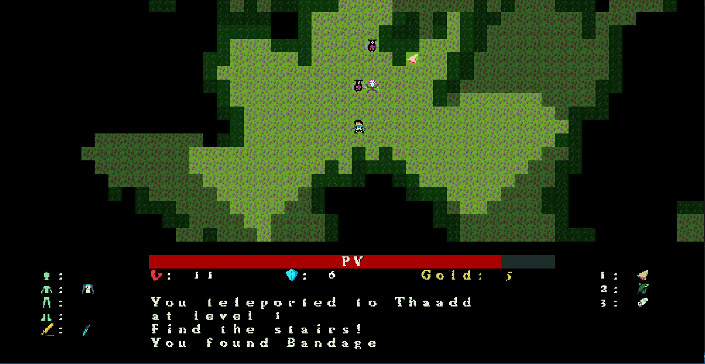

<h1 align="center">Artifacts : A roguelike game written in C#</h1>

<p align="center">
    
</p>

### Game story :

You are a space patroller searching for the 3 legendary artifacts. They are hidden in some forbidden ruins in 3 abandoned planets. Try to find them as fast as possible. You've been given a spaceship to accomplish your mission. You can teleport to the planets through the 3 teleporters, and buy items to the merchants. Good luck.

### Commands :

* Move with z q s d
* Attack by clicking toward the enemy
* Press 1,2,3,4 or 5 to use items
* Press Left Ctrl to go through teleportation portals or stairs.

### Requirements :

* .NET 5.0.
* RLNET 1.0.6
* RogueSharp 4.2.0
* System.Drawing.Common 5.0.2

To install RogueSharp, RLNET and System.Drawing.Common with dotnet :
```
dotnet add package RLNET --version 1.0.6
dotnet add package RogueSharp --version 4.2.0
dotnet add package System.Drawing.Common --version 5.0.2
```


### TODO :

- [ ] Add music
- [ ] Add scoreboard
- [ ] ...


